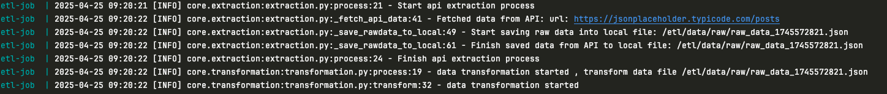
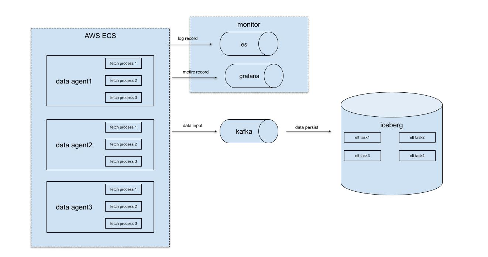

# Overview

Open API is useful for everyone to get public dataset on your own demand,e.g. sentiment analysis,data mock , dashboard
create

This project provide a tiny framework to response from an open api(https://jsonplaceholder.typicode.com/) , we will
get posts data from the given api
and then persist both raw data and parsed data,here are some features

+ storage supported: local file system
+ api fetch interval : default 30 seconds
+

# Quick Start

## Local

if you want to run the framework locally ,there is the following steps

### step1:check prerequisite

+ python 3.10

### step2:install uv

```bash
  # On macOS and Linux.
  curl -LsSf https://astral.sh/uv/install.sh | sh
  
  # On Windows.
  powershell -ExecutionPolicy ByPass -c "irm https://astral.sh/uv/install.ps1 | iex"
  
  # With pip.
  pip install uv

```

### step3 clone and install python package

```bash
  git clone xxx.git
  cd etl
  uv pip install -r pyproject.toml 
```

### run

``` bash
python run main.py
```

## Using Docker

### step1:check prerequisite

+ docker >= 28.0.1

## step2:build and run

```shell
git clone xxx.git
cd etl

## start docker container with fist time

docker-compose up --build

## start docker container

docker-compose up 
```
If you see the image as blow , the framework is now running.


you can find the api data in the directory
```shell
## raw data 
etl/data/raw/*

## struct data
etl/data/processed/*
default data delimiter = '\u0001'

```

# Project Structure

```

etl/
├── core                # core code  
├── data                # persist data 
   ├── data_lake        # simiulate data lake
   ├── processed        # struct data
   ├── raw              # raw data 
├── logs                # log for observability 


```

# Productionize
here is the consideration of how to improve framework to a mature product 

1. support for  various type of data
   1. file
   2. api
   3. databases
2. data extraction should exec concurrently and keep exactly once data semantics from end to end  
3. log should persist with external storage for monitor
5. In large data amount scenario we need a high throughput middleware  for decouple getting  data and data transformation ,
6. data lake can ingest the raw data and transform within data lake by etl tasks

the whole architecture can be as followed 




